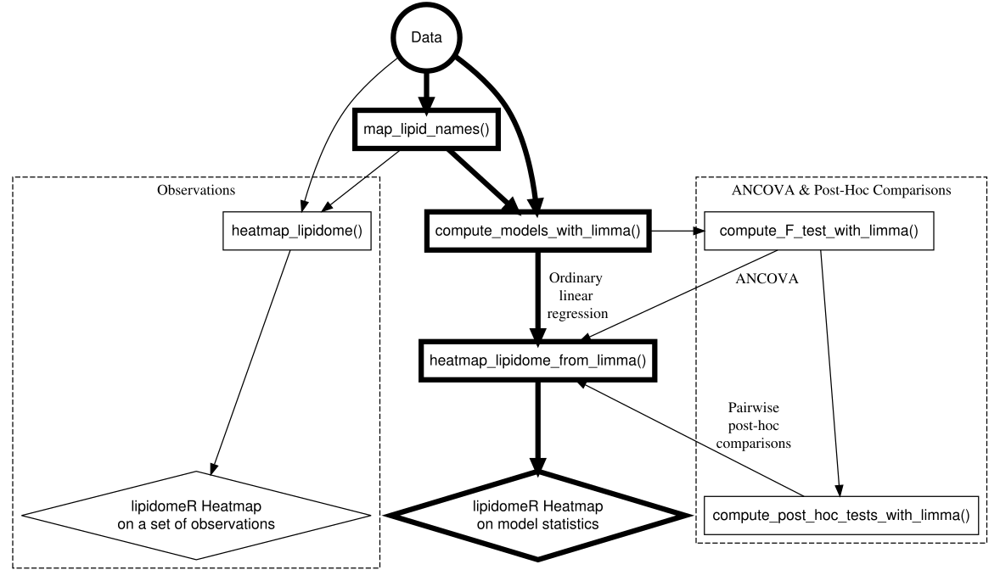

# Introduction

Create lipidome-wide heatmaps of statistics with the lipidomeR.
    The lipidomeR provides a streamlined pipeline for systematic 
    interpretation of the lipidome through publication-ready visualizations 
    of regression models fitted on lipidomics data. 
    With lipidomeR, associations between covariates and the lipidome 
    can be interpreted systematically and intuitively through heatmaps, where 
    lipids are organized based on their class, size and level of saturation.
    With lipidomeR, you can create lipidome-wide heatmaps of 
    statistical associations, changes or differences. 
    lipidomeR helps you to immediately understand complex patterns 
    in high-dimensional lipidomics data. 
    The heatmaps are provided with publication-ready quality and 
    the results behind the visualizations are based on rigorous statistical 
    models. 
    In lipidomeR heatmaps, lipids are categorized by the lipid class and 
    presented on a two-dimensional map in terms of their size and 
    level of saturation, providing a systems-level understanding of changes in 
    the lipidome.

# Getting Started

```{r Install, eval = FALSE}

install.packages( "lipidomeR" )
library( "lipidomeR" )

```

# Workflow

* The typical lipidomeR workflow, involving an ordinary linear regression model, 
    is shown in bold.

```{r Workflow, echo = FALSE}

workflow <-
  DiagrammeR::grViz(
    diagram =
      "digraph flowchart {
    
      graph [compound = true, dir = forward, rankdir = TB]
      
      # graph [splines = ortho]
      
      node [fontname = Helvetica]
      
      # Root
      
      node [shape = circle, penwidth = 5]        
      tab1 [label = '@@1']
      
      # Observations route
      
      subgraph cluster_Observations {
      
        graph[shape = rectangle, style = dashed, label = 'Observations']
        node [shape = rectangle, penwidth = 1, color = black]
        tab7 [label = '@@7']
        node [shape = diamond, penwidth = 1]
        tab9 [label = '@@9']
        
      }
      
      # Primary route
      
      node [shape = rectangle, penwidth = 5]
      tab2 [label = '@@2']
      tab3 [label = '@@3']
      tab4 [label = '@@4']
      
      tab2 -> tab3 [penwidth=5];
      tab3 -> tab4 [penwidth=5, weight=99, label = '  Ordinary\\n  linear\\n   regression'];
      
      node [shape = diamond, penwidth = 5,] 
      tab8 [label = '@@8']
      tab4 -> tab8 [penwidth=5, weight = 99];
      
      # ANCOVA route
      
      subgraph cluster_ANCOVA {
      
        graph [shape = rectangle, style = dashed, label = 'ANCOVA & Post-Hoc Comparisons']
        node [shape = rectangle, penwidth = 1, width = 3, color = black]
        tab5 [label = '@@5']
        tab6 [label = '@@6']
        tab5 -> tab6;
        
      }
      
      # Edges
      
      tab1 -> tab2 [penwidth=5];
      tab1 -> tab3 [penwidth=5];
      tab3 -> tab5;
      tab1 -> tab7;
      tab2 -> tab7;
      tab7 -> tab9;
      tab5 -> tab4 [label = 'ANCOVA\\n\\n\\n'];
      tab6 -> tab4 [label = 'Pairwise\\npost-hoc\\ncomparisons'];
      }

      [1]: 'Data'
      [2]: 'map_lipid_names()'
      [3]: 'compute_models_with_limma()'
      [4]: 'heatmap_lipidome_from_limma()'
      [5]: 'compute_F_test_with_limma()'
      [6]: 'compute_post_hoc_tests_with_limma()'
      [7]: 'heatmap_lipidome()'
      [8]: 'lipidomeR Heatmap\\non model statistics'
      [9]: 'lipidomeR Heatmap\\non a set of observations'
      "
  )

workflow.rsvg <- DiagrammeRsvg::export_svg( gv = workflow )

workflow.rsvg <- charToRaw( x = workflow.rsvg )

workflow.svg <- rsvg::rsvg_svg(
   svg = workflow.rsvg,
   file = "README_files/workflow.svg"
)

```



# Examples

## humanlipidome

```{r Load-Humanlipidome, echo = FALSE, results = FALSE}

load( "data/humanlipidome.rda" )

tmp <- list.files( path = "R/", full.names = TRUE )
tmp <- tmp[ !grepl( x = tmp, pattern = "\\-data.R" ) ]

lapply( X = tmp, FUN = source )

```

```{r Data-Humanlipidome, eval = FALSE}

data( lipidomeR::humanlipidome )

```

```{r Humanlipidome, fig.width = 9, fig.height = 9, warning = FALSE}

# Transform the concentrations into log-10 scale.

humanlipidome$'Concentration_log10_umol_per_mL' <-
   log10( humanlipidome$'Concentration' )

# Enumerate the lipid names into values.

names.mapping <- map_lipid_names( x = humanlipidome$'Name' )

# Create the lipidomeR heatmap of lipid concentrations.

heatmap_lipidome(
   x = humanlipidome[ , c( "Name", "Concentration_log10_umol_per_mL" ) ],
   names.mapping = names.mapping,
   class.facet = "wrap",
   x.names = "Name",
   fill.limits =
       range(
           x = humanlipidome$"Concentration_log10_umol_per_mL",
           na.rm = TRUE
       ),
   fill.midpoint =
       sum(
           range(
               x = humanlipidome$"Concentration_log10_umol_per_mL",
               na.rm = TRUE
           )
       ) / 2,
   melt.value.name = "Concentration_umol_per_mL_log10",
   scales = "free"
)

```

## cancerlipidome

```{r Load-Cancerlipidome, echo = FALSE, results = FALSE}

load( "data/cancerlipidome.rda")

```

```{r Data-Cancerlipidome, eval = FALSE}

data( lipidomeR::cancerlipidome )

```

```{r Cancerlipidome, fig.width = 9, fig.height = 9, warning = FALSE}

# Convert the data into wide format, where each lipid is one column and
# each sample is one row.

cancerlipidome.wide <-
   tidyr::pivot_wider(
       data = cancerlipidome,
       names_from = Lipid_Name,
       values_from = Lipid_Level
   )

# Inspect the data frame.
# View( cancerlipidome.wide )

# Create a mapping of the lipid names.

names.mapping <-
   map_lipid_names( x = unique( cancerlipidome$"Lipid_Name" ) )

# Compute the regression models.

result.limma <-
   compute_models_with_limma(
       x = cancerlipidome.wide,
       dependent.variables = names.mapping$"Name",
       independent.variables = c( "Group" )
   )

# Create the figure.

figure.output <-
   heatmap_lipidome_from_limma(
       x = result.limma$"model",
       names.mapping = names.mapping,
       axis.x.carbons = FALSE,
       class.facet = "row",
       plot.all = TRUE,
       plot.individual = FALSE,
       print.figure = TRUE,
       scales = "free",
       space = "free"
   )

figure.output <-
   heatmap_lipidome_from_limma(
       x = result.limma$"model",
       names.mapping = names.mapping,
       axis.x.carbons = FALSE,
       class.facet = "wrap",
       omit.class = "PA",
       plot.all = FALSE,
       plot.individual = TRUE,
       print.figure = FALSE,
       scales = "free",
       space = "free"
   )

# Print the figure of differences between cancer and benign tumors.

print( figure.output[[ "GroupCancer" ]] )

```

## liverlipidome

```{r Load-liverlipidome, echo = FALSE, results = FALSE}

load( "data/liverlipidome.rda" )

```

```{r Data-Liverlipidome, eval = FALSE}

data( lipidomeR::liverlipidome )

```

```{r Liverlipidome, fig.width = 9, fig.height = 9, warning = FALSE}

# Convert the data into wide format, where each lipid is one column and
# each sample is one row.

liverlipidome.wide <-
   tidyr::pivot_wider(
       data = liverlipidome,
       names_from = Lipid_Name,
       values_from = Lipid_Level
   )

# Create a mapping of the lipid names.
names.mapping <-
   map_lipid_names( x = unique( liverlipidome$"Lipid_Name" ) )

# Compute the regression models.

result.limma <-
   compute_models_with_limma(
       x = liverlipidome.wide,
       dependent.variables = names.mapping$"Name",
       independent.variables = c( "Diagnosis" ),
       F.test = TRUE # Compute an F-test for a factor variable.
   )
# Compute the F-test.

result.limma <-
   compute_F_test_with_limma(
       x = result.limma,
       print.table = FALSE
   )

# Print a figure of the F-test.

figure.output <-
  heatmap_lipidome_from_limma(
      x = result.limma,
      names.mapping = names.mapping,
      F.test = TRUE,
      axis.x.carbons = FALSE,
      class.facet = "wrap",
      plot.all = FALSE,
      plot.individual = TRUE,
      scales = "free",
      space = "free"
  )

# Compute pairwise post-hoc comparisons between the factor levels for
# the dependent variables (i.e., lipids) with a significant F-test result.

result.limma <-
   compute_post_hoc_test_with_limma(
       x = result.limma,
       remap.level.names = TRUE
   )

# Print a figure of all post-hoc comparisons.

figure.output <-
    heatmap_lipidome_from_limma(
    x = result.limma$"result.post.hoc.test",
    names.mapping = names.mapping,
    axis.x.carbons = FALSE,
    plot.all = TRUE,
    plot.individual = FALSE,
    scales = "free",
    space = "free"
)

# Specify the contrasts of the post-hoc comparison that will be included
# in the figure.

contrasts.included <-
   c( "DiagnosisSteatosis", "DiagnosisNASH", "DiagnosisCirrhosis" )

# Get the omitted contrasts based on the above definition.

contrasts.omitted <-
   colnames( result.limma$"result.post.hoc.test"$"p.value" )[
       !(
           colnames( result.limma$"result.post.hoc.test"$"p.value" ) %in%
           contrasts.included
       )
   ]

# Find dependent variables (i.e., lipids) that have any significant
# difference.

has.any.significant <-
   apply(
       X =
           result.limma$"result.post.hoc.test"$"p.value"[
               ,
               contrasts.included
           ],
       MAR = 2,
       FUN = p.adjust,
       method = "BH"
   )

has.any.significant <-
   rownames(
       has.any.significant[
           apply(
               X = has.any.significant < 0.05,
               MAR = 1,
               FUN = any
           ),
       ]
   )

# Include in the figure only lipid classes that have at least four
# significant differences.

classes.included <-
   names(
       which(
           table(
               names.mapping[
                   make.names( has.any.significant ), "Class"
               ]
           ) > 3
       )
   )

classes.omitted <- unique( names.mapping$"Class" )
classes.omitted <-
   classes.omitted[ !( classes.omitted ) %in% classes.included ]

# Print a figure of the selected post-hoc-comparisons.

figure.output <-
   heatmap_lipidome_from_limma(
       x = result.limma$"result.post.hoc.test",
       names.mapping = names.mapping,
       axis.x.carbons = FALSE,
       omit.class = classes.omitted,
       omit.factor = contrasts.omitted,
       plot.all = TRUE,
       plot.individual = FALSE,
       scales = "free",
       space = "free"
   )

```

# SessionInfo

```{r SessionInfo}

utils::sessionInfo()

```
