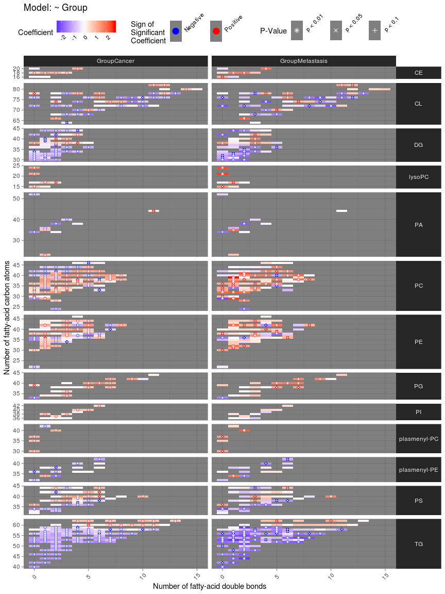

lipidomeR
================
Tommi Suvitaival, Steno Diabetes Center Copenhagen, <TSUV0001@RegionH.DK>
2020-03-06

Introduction
============

Create lipidome-wide heatmaps of statistics with the 'lipidomeR'. The 'lipidomeR' provides a streamlined pipeline for the systematic interpretation of the lipidome through publication-ready visualizations of regression models fitted on lipidomics data. With 'lipidomeR', associations between covariates and the lipidome can be interpreted systematically and intuitively through heatmaps, where lipids are categorized by the lipid class and are presented on two-dimensional maps organized by the lipid size and level of saturation. This way, the 'lipidomeR' helps you gain an immediate understanding of the multivariate patterns in the lipidome already at first glance. You can create lipidome-wide heatmaps of statistical associations, changes, differences, variation, or other lipid-specific values.
The heatmaps are provided with publication-ready quality and the results behind the visualizations are based on rigorous statistical models.

Getting Started
===============

``` r
install.packages( "lipidomeR" )
library( "lipidomeR" )
```

Workflow
========

-   The typical lipidomeR workflow, involving an ordinary linear regression model, is shown in bold.


Examples
========

humanlipidome
-------------

``` r
# Load the humanlipidome data set.

data( lipidomeR::humanlipidome )
```

``` r
# Transform the concentrations into log-10 scale.

humanlipidome$'Concentration_log10_umol_per_mL' <-
   log10( humanlipidome$'Concentration' )

# Enumerate the lipid names into values.

names.mapping <- map_lipid_names( x = humanlipidome$'Name' )

# Create the lipidomeR heatmap of lipid concentrations.

heatmap_lipidome(
   x = humanlipidome[ , c( "Name", "Concentration_log10_umol_per_mL" ) ],
   names.mapping = names.mapping,
   class.facet = "wrap",
   x.names = "Name",
   fill.limits =
       range(
           x = humanlipidome$"Concentration_log10_umol_per_mL",
           na.rm = TRUE
       ),
   fill.midpoint =
       sum(
           range(
               x = humanlipidome$"Concentration_log10_umol_per_mL",
               na.rm = TRUE
           )
       ) / 2,
   melt.value.name = "Concentration_umol_per_mL_log10",
   scales = "free"
)
```


cancerlipidome
--------------

``` r
# Load the cancerlipidome data set.

data( lipidomeR::cancerlipidome )
```

``` r
# Convert the data into wide format, where each lipid is one column and
# each sample is one row.

cancerlipidome.wide <-
   tidyr::pivot_wider(
       data = cancerlipidome,
       names_from = Lipid_Name,
       values_from = Lipid_Level
   )

# Inspect the data frame.
# View( cancerlipidome.wide )

# Create a mapping of the lipid names.

names.mapping <-
   map_lipid_names( x = unique( cancerlipidome$"Lipid_Name" ) )

# Compute the regression models.

result.limma <-
   compute_models_with_limma(
       x = cancerlipidome.wide,
       dependent.variables = names.mapping$"Name",
       independent.variables = c( "Group" )
   )
```

    ## Fitting models: ~ Group

``` r
# Create the figure of all lipids and factors.

figure.output <-
   heatmap_lipidome_from_limma(
       x = result.limma$"model",
       names.mapping = names.mapping,
       axis.x.carbons = FALSE,
       class.facet = "row",
       plot.all = TRUE,
       plot.individual = FALSE,
       print.figure = TRUE,
       scales = "free",
       space = "free"
   )
```



``` r
# Create factor-specific figures.

figure.output <-
   heatmap_lipidome_from_limma(
       x = result.limma$"model",
       names.mapping = names.mapping,
       axis.x.carbons = FALSE,
       class.facet = "wrap",
       omit.class = "PA",
       plot.all = FALSE,
       plot.individual = TRUE,
       print.figure = FALSE,
       scales = "free",
       space = "free"
   )

# Print the figure of differences between cancer and benign tumors.

print( figure.output[[ "GroupCancer" ]] )
```


liverlipidome
-------------

``` r
# Load the liverlipidome data set.

data( lipidomeR::liverlipidome )
```

``` r
# Convert the data into wide format, where each lipid is one column and
# each sample is one row.

liverlipidome.wide <-
   tidyr::pivot_wider(
       data = liverlipidome,
       names_from = Lipid_Name,
       values_from = Lipid_Level
   )

# Create a mapping of the lipid names.

names.mapping <-
   map_lipid_names( x = unique( liverlipidome$"Lipid_Name" ) )

# Compute the regression models.

result.limma <-
   compute_models_with_limma(
       x = liverlipidome.wide,
       dependent.variables = names.mapping$"Name",
       independent.variables = c( "Diagnosis" ),
       F.test = TRUE # Compute an F-test for a factor variable.
   )
```

    ## Fitting models: ~ Diagnosis

``` r
# Compute the F-test.

result.limma <-
   compute_F_test_with_limma(
       x = result.limma,
       print.table = FALSE
   )

# Print a figure of the F-test.

figure.output <-
  heatmap_lipidome_from_limma(
      x = result.limma,
      names.mapping = names.mapping,
      F.test = TRUE,
      axis.x.carbons = FALSE,
      class.facet = "wrap",
      plot.all = FALSE,
      plot.individual = TRUE,
      scales = "free",
      space = "free"
  )
```


``` r
# Compute pairwise post-hoc comparisons between the factor levels for
# the dependent variables (i.e., lipids) with a significant F-test result.

result.limma <-
   compute_post_hoc_test_with_limma(
       x = result.limma,
       remap.level.names = TRUE
   )
```

``` r
# Print a figure of all post-hoc comparisons.

figure.output <-
    heatmap_lipidome_from_limma(
    x = result.limma$"result.post.hoc.test",
    names.mapping = names.mapping,
    axis.x.carbons = FALSE,
    plot.all = TRUE,
    plot.individual = FALSE,
    scales = "free",
    space = "free"
)
```


``` r
# Specify the contrasts of the post-hoc comparison that will be included
# in the figure.

contrasts.included <-
   c( "DiagnosisSteatosis", "DiagnosisNASH", "DiagnosisCirrhosis" )

# Get the omitted contrasts based on the above definition.

contrasts.omitted <-
   colnames( result.limma$"result.post.hoc.test"$"p.value" )[
       !(
           colnames( result.limma$"result.post.hoc.test"$"p.value" ) %in%
           contrasts.included
       )
   ]

# Find dependent variables (i.e., lipids) that have any significant
# difference.

has.any.significant <-
   apply(
       X =
           result.limma$"result.post.hoc.test"$"p.value"[
               ,
               contrasts.included
           ],
       MAR = 2,
       FUN = p.adjust,
       method = "BH"
   )

has.any.significant <-
   rownames(
       has.any.significant[
           apply(
               X = has.any.significant < 0.05,
               MAR = 1,
               FUN = any
           ),
       ]
   )

# Include in the figure only lipid classes that have at least four
# significant differences.

classes.included <-
   names(
       which(
           table(
               names.mapping[
                   make.names( has.any.significant ), "Class"
               ]
           ) > 3
       )
   )

classes.omitted <- unique( names.mapping$"Class" )
classes.omitted <-
   classes.omitted[ !( classes.omitted ) %in% classes.included ]

# Print a figure of the selected post-hoc-comparisons.

figure.output <-
   heatmap_lipidome_from_limma(
       x = result.limma$"result.post.hoc.test",
       names.mapping = names.mapping,
       axis.x.carbons = FALSE,
       omit.class = classes.omitted,
       omit.factor = contrasts.omitted,
       plot.all = TRUE,
       plot.individual = FALSE,
       scales = "free",
       space = "free"
   )
```


SessionInfo
===========

``` r
utils::sessionInfo()
```

    ## R version 3.6.1 (2019-07-05)
    ## Platform: x86_64-pc-linux-gnu (64-bit)
    ## Running under: CentOS Linux 7 (Core)
    ## 
    ## Matrix products: default
    ## BLAS/LAPACK: /services/tools/intel/perflibs/2019_update5/compilers_and_libraries_2019.5.281/linux/mkl/lib/intel64_lin/libmkl_gf_lp64.so
    ## 
    ## locale:
    ##  [1] LC_CTYPE=en_US.UTF-8       LC_NUMERIC=C              
    ##  [3] LC_TIME=en_US.UTF-8        LC_COLLATE=en_US.UTF-8    
    ##  [5] LC_MONETARY=en_US.UTF-8    LC_MESSAGES=en_US.UTF-8   
    ##  [7] LC_PAPER=en_US.UTF-8       LC_NAME=C                 
    ##  [9] LC_ADDRESS=C               LC_TELEPHONE=C            
    ## [11] LC_MEASUREMENT=en_US.UTF-8 LC_IDENTIFICATION=C       
    ## 
    ## attached base packages:
    ## [1] stats     graphics  grDevices utils     datasets  methods   base     
    ## 
    ## loaded via a namespace (and not attached):
    ##  [1] Rcpp_1.0.3         compiler_3.6.1     pillar_1.4.3       RColorBrewer_1.1-2
    ##  [5] plyr_1.8.5         tools_3.6.1        digest_0.6.25      jsonlite_1.6.1    
    ##  [9] evaluate_0.14      lifecycle_0.1.0    tibble_2.1.3       gtable_0.3.0      
    ## [13] pkgconfig_2.0.3    rlang_0.4.4        rstudioapi_0.11    curl_4.3          
    ## [17] yaml_2.2.1         xfun_0.12          dplyr_0.8.4        DiagrammeR_1.0.5  
    ## [21] stringr_1.4.0      knitr_1.28         vctrs_0.2.3        htmlwidgets_1.5.1 
    ## [25] tidyselect_1.0.0   grid_3.6.1         glue_1.3.1         R6_2.4.1          
    ## [29] DiagrammeRsvg_0.1  rmarkdown_2.1      limma_3.42.2       tidyr_1.0.2       
    ## [33] farver_2.0.3       purrr_0.3.3        ggplot2_3.2.1      reshape2_1.4.3    
    ## [37] magrittr_1.5       ellipsis_0.3.0     scales_1.1.0       htmltools_0.4.0   
    ## [41] assertthat_0.2.1   colorspace_1.4-1   labeling_0.3       rsvg_1.3          
    ## [45] V8_3.0.1           stringi_1.4.6      visNetwork_2.0.9   lazyeval_0.2.2    
    ## [49] munsell_0.5.0      crayon_1.3.4
